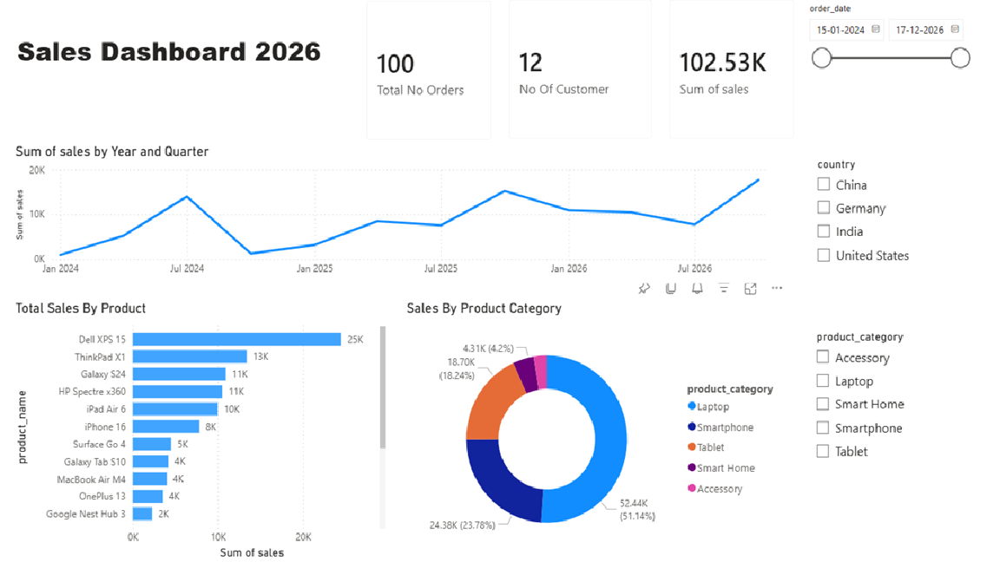

# Sales Dashboard 2026 – Power BI Project
## Overview
This project is an interactive Power BI Sales Dashboard designed to analyze sales performance, customer insights, product category trends, and order distribution across multiple countries.

The dashboard helps business users monitor:
* Total sales performance
* Number of orders
* Customer count
* Product-wise sales
* Product category contribution
* Country-level filtering
* Date-wise sales trends

# Dashboard Preview


# Project Objectives
The primary objective of this dashboard is to:
* Track overall sales performance
* Analyze customer purchasing behavior
* Identify top-selling products
* Monitor category-wise revenue contribution
* Provide interactive filtering for better decision-making
* Create a clean and business-friendly visualization using Power BI


# Tools & Technologies Used
| Tool                  | Purpose                           |
| --------------------- | --------------------------------- |
| Power BI Desktop      | Dashboard Development             |
| Microsoft Excel / CSV | Data Source                       |
| Power Query           | Data Transformation               |
| DAX                   | Calculated Measures               |
| GitHub                | Version Control & Project Hosting |


# Dataset Information
## 1. Orders Dataset (`orders.csv`)

Contains transactional sales information.
### Columns
| Column Name      | Description             |
| ---------------- | ----------------------- |
| order_id         | Unique order identifier |
| order_date       | Date of order           |
| customer_id      | Unique customer ID      |
| product_name     | Product purchased       |
| product_category | Product category        |
| quantity         | Number of units sold    |
| sales            | Total sales amount      |

### Total Records
* 100 Orders

## 2. Customers Dataset (`customers.csv`)
Contains customer demographic information.

### Columns
| Column Name | Description                |
| ----------- | -------------------------- |
| customer_id | Unique customer identifier |
| first_name  | Customer first name        |
| last_name   | Customer last name         |
| country     | Country                    |
| state       | State                      |
| city        | City                       |
| score       | Customer score             |

### Total Records
* 12 Customers

# Data Model
The dashboard uses a relationship between:
* `orders.customer_id`
* `customers.customer_id`

Relationship Type:
* One-to-Many
* Customers → Orders

# Dashboard Features
## KPI Cards
The dashboard contains the following KPI cards:
| KPI             | Description             |
| --------------- | ----------------------- |
| Total No Orders | Total count of orders   |
| No Of Customer  | Distinct customer count |
| Sum of Sales    | Total revenue generated |

## Visualizations
### 1. Sales Trend by Year and Quarter
* Line chart showing sales growth over time
* Helps identify sales trends and seasonality

### 2. Total Sales by Product
* Horizontal bar chart
* Displays top-performing products

### 3. Sales by Product Category
* Donut chart representing category-wise sales distribution

### 4. Interactive Filters (Slicers)
* Order Date
* Country
* Product Category
  
# Key Insights
Some business insights derived from the dashboard:
* Laptops contribute the highest share of sales.
* Dell XPS 15 and ThinkPad X1 are among the top-selling products.
* Smartphone and Laptop categories dominate total revenue.
* Sales show gradual growth from 2024 to 2026.
* Country and category filters help analyze regional performance.

# Power BI Measures (DAX)
## Total Sales
```DAX
Total Sales = SUM(orders[sales])
```
## Total Orders
```DAX
Total Orders = COUNT(orders[order_id])
```
## Total Customers
```DAX
Total Customers = DISTINCTCOUNT(customers[customer_id])
```

# Steps to Build the Dashboard
## Step 1: Load Data
* Import `orders.csv`
* Import `customers.csv`

## Step 2: Transform Data
* Clean null values
* Convert data types
* Format dates

## Step 3: Create Relationships
* Connect customer_id between both tables

## Step 4: Create Measures
* Build DAX calculations for KPIs

## Step 5: Create Visualizations
* KPI Cards
* Line Chart
* Bar Chart
* Donut Chart
* Slicers

## Step 6: Format Dashboard
* Add titles
* Improve layout
* Apply consistent colors and formatting

# Folder Structure
PowerBI-Sales-Dashboard/
│
├── data/
│   ├── customers.csv
│   └── orders.csv
│
├── images/
│   └── PowerBI_Sales_Dashboard.png
│
├── dashboard/
│   └── SalesDashboard.pbix
│
├── README.md
└── LICENSE

# How to Run the Project
## Prerequisites
* Install Power BI Desktop

## Steps
1. Clone the repository
2. Open the `.pbix` file in Power BI Desktop
3. Refresh the data
4. Explore the dashboard visuals

# Recommended GitHub Repository Name
PowerBI-Sales-Dashboard

# Recommended Tags
* powerbi
* dashboard
* data-analytics
* business-intelligence
* dax
* data-visualization
* sales-dashboard
* power-query

# Future Enhancements
Possible future improvements:
* Add profit analysis
* Add regional sales map
* Add forecasting visuals
* Add customer segmentation
* Add drill-through reports
* Connect live database source

# Author
Shivana Gouda N S

# License
This project is open-source and available under the MIT License.
